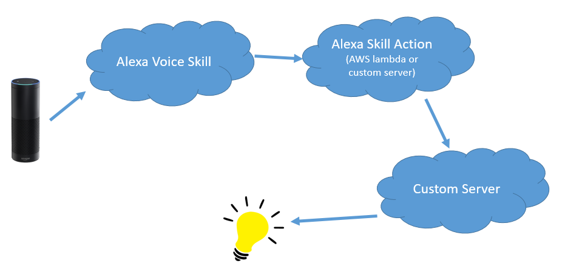

# myAlexaOnWindows

## To-do:

	* [ ] Create Alexa on Windows
	* [ ] Create Alexa Skill to control the light status (or LED)
	* [ ] Create Action for Alexa Skill
		* [ ] Using AWS Lambda to handle request from Alexa Voice Skill
		* [ ] Connect AWS Lambda to Light Control Server
		* [ ] Using Own Server to handle request from Alexa Voice Skill
		* [ ] Connect Own Server to Light Control Server
	* [ ] Create server to control the action of turning on or off the light
	* [ ] Create actuator to turn on or off the light
	
	
## Tutorial:

	# Install Alexa (Alexa Voice Service) on Windows (all steps needed to be done to run properly)
		https://github.com/alexa/alexa-avs-sample-app/wiki/Windows
		
		
	# Create Alexa Voice Skill Example
		https://developer.amazon.com/alexa-skills-kit/alexa-skill-quick-start-tutorial
		
		
	# Alexa control light example on Arduino
		http://www.instructables.com/id/Using-Amazon-Alexa-to-Control-Ameba-Arduino/

Implementation:
	
	
 

Note:
	#1 Alexa Voice Skill (AVS): Control the light by saying “Control Light, turn on (or off) the light”
		ControlLight Intent:
		
			{
			  "intents": [
				{
				  "intent": "ControlLight",
				  "slots": [
					{
					  "name": "LightState",
					  "type": "LIGHT_STATE"  # value = “on” or “off”
					}
				  ]
				}
			  ]
			}
			
		ControlLight Sample Utterances: 
		
			ControlLight Turn {LightState} the light
			ControlLight Turn the light {LightState}
			
		Request from AVS:
		
			LaunchRequest (by say open skill-name)
		
				{
				  "session": {
					"new": true,
					"sessionId": "SessionId.xxx",
					"application": {
					  "applicationId": "amzn1.ask.skill.xxx"
					},
					"attributes": {},
					"user": {
					  "userId": "amzn1.ask.account.xxx"
					}
				  },
				  "request": {
					"type": "LaunchRequest",
					"requestId": "EdwRequestId.xxx",
					"locale": "en-US",
					"timestamp": "2017-12-22T07:36:49Z"
				  },
				  "context": {
					"AudioPlayer": {
					  "playerActivity": "IDLE"
					},
					"System": {
					  "application": {
						"applicationId": "amzn1.ask.skill.xxx"
					  },
					  "user": {
						"userId": "amzn1.ask.account.xxx"
					  },
					  "device": {
						"supportedInterfaces": {}
					  }
					}
				  },
				  "version": "1.0"
				}
			
			IntentRequest (by say intent skill-name)
				
				{
				  "session": {
					"new": false,
					"sessionId": "SessionId.xxx",
					"application": {
					  "applicationId": "amzn1.ask.skill.xxx"
					},
					"attributes": {},
					"user": {
					  "userId": "amzn1.ask.account.xxx"
					}
				  },
				  "request": {
					"type": "IntentRequest",
					"requestId": "EdwRequestId.xxx",
					"intent": {
					  "name": "ControlLight",
					  "slots": {
						"LightState": {
						  "name": "LightState",
						  "value": "off"
						}
					  }
					},
					"locale": "en-US",
					"timestamp": "2017-12-22T07:39:08Z"
				  },
				  "context": {
					"AudioPlayer": {
					  "playerActivity": "IDLE"
					},
					"System": {
					  "application": {
						"applicationId": "amzn1.ask.skill.xxx"
					  },
					  "user": {
						"userId": "amzn1.ask.account.xxx"
					  },
					  "device": {
						"supportedInterfaces": {}
					  }
					}
				  },
				  "version": "1.0"
				}
				
			SessionEndRequest (by say exit)
				
				{
				  "session": {
					"new": false,
					"sessionId": "SessionId.xxx",
					"application": {
					  "applicationId": "amzn1.ask.skill.xxx"
					},
					"attributes": {},
					"user": {
					  "userId": "amzn1.ask.account.xxx"
					}
				  },
				  "request": {
					"type": "SessionEndedRequest",
					"requestId": "EdwRequestId.xxx",
					"reason": "USER_INITIATED",
					"locale": "en-US",
					"timestamp": "2017-12-22T07:37:17Z"
				  },
				  "context": {
					"AudioPlayer": {
					  "playerActivity": "IDLE"
					},
					"System": {
					  "application": {
						"applicationId": "amzn1.ask.skill.xxx"
					  },
					  "user": {
						"userId": "amzn1.ask.account.xxx"
					  },
					  "device": {
						"supportedInterfaces": {}
					  }
					}
				  },
				  "version": "1.0"
				}

	#2 Once skill is create on Alexa Voice Skill, the proper Alexa Voice Service will have that skill, thourgh that skill has not published yet
	
	#3 Alexa Voice Skill Action on Lambda: handle 3 requests: on_launch(), on_intend(), on_session_end()

